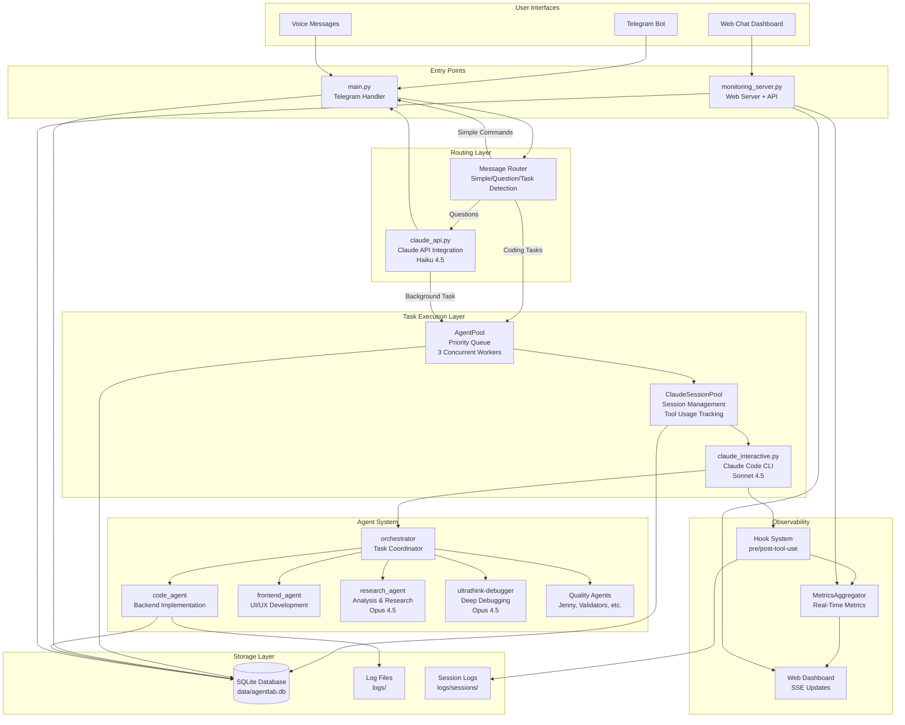
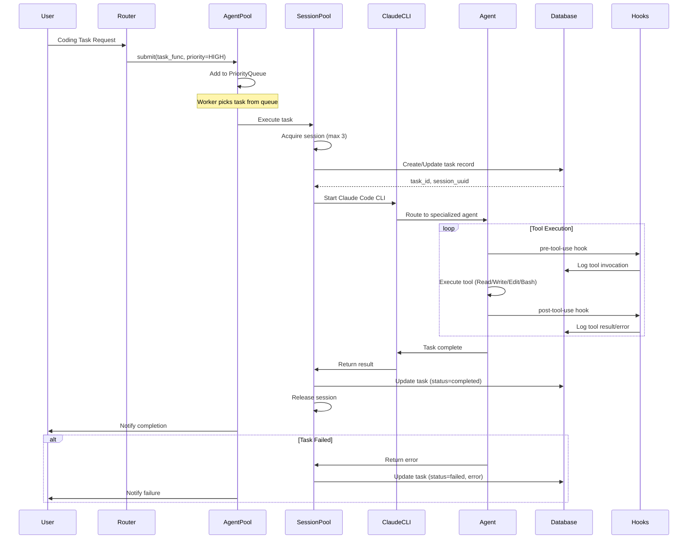
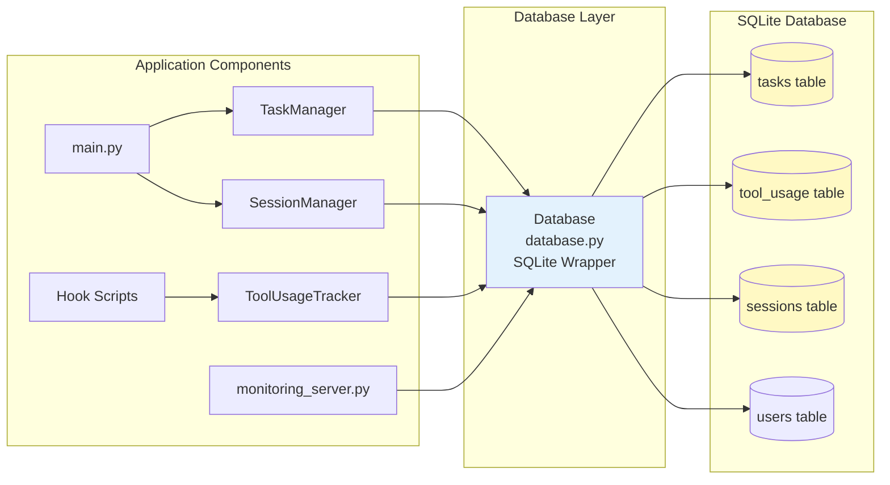
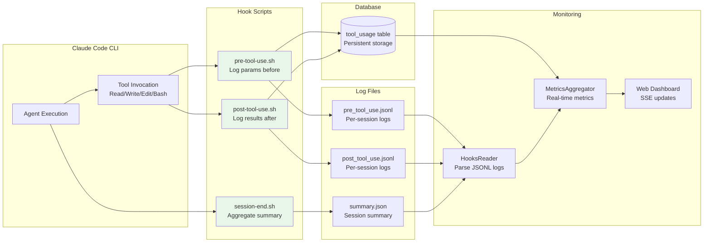

# AMIGA Architecture

> Comprehensive system architecture documentation for AMIGA (Autonomous Modular Interactive Graphical Agent)

**Last Updated**: 2025-10-22
**Version**: 1.0

---

## Table of Contents

1. [Overview](#overview)
2. [System Architecture](#system-architecture)
3. [Message Routing Flow](#message-routing-flow)
4. [Background Task Execution](#background-task-execution)
5. [Database Interactions](#database-interactions)
6. [Hook System Data Flow](#hook-system-data-flow)
7. [Component Reference](#component-reference)
8. [Data Flow Narratives](#data-flow-narratives)

---

## Overview

### Project Purpose

AMIGA (Autonomous Modular Interactive Graphical Agent) is a Telegram bot that provides AI-powered assistance for both conversational Q&A and complex coding tasks. The system intelligently routes work to the appropriate Claude model based on task complexity, optimizing for both cost and capability.

### Design Philosophy

**Right model for the right task**: Fast and cheap (Haiku 4.5) for questions, powerful and thorough (Sonnet 4.5) for code implementation.

**Key Architectural Decisions**:

1. **Async-First Design**: All I/O operations use asyncio for non-blocking concurrency
2. **Manager Pattern**: Encapsulated resource management (tasks, sessions, agents, worktrees)
3. **SQLite Backend**: Centralized database for tasks, tool usage, and user sessions
4. **Hook-Based Observability**: Bash hooks track tool usage for real-time metrics
5. **Priority Queue System**: Background task execution with priority levels (URGENT, HIGH, NORMAL, LOW)
6. **Per-User Isolation**: Independent message queues, sessions, and cost tracking per Telegram user

### Technology Stack

- **Python 3.13**: Core application language with asyncio
- **Claude API (Haiku 4.0)**: Fast Q&A and routing decisions
- **Claude Code CLI (Sonnet 4.5)**: Coding task execution with full tool access
- **python-telegram-bot**: Telegram Bot API integration
- **SQLite**: Persistent storage (tasks, tool usage, sessions)
- **Flask + SSE**: Real-time monitoring dashboard
- **WebSockets (SocketIO)**: Web chat interface
- **Whisper**: Voice message transcription

---

## System Architecture



### Layer Responsibilities

**User Interfaces**: Multiple input channels (Telegram, web chat, voice)

**Entry Points**: Main application entry and web server

**Routing Layer**: Intelligent routing based on query complexity

**Task Execution Layer**: Background task management with priority queuing

**Agent System**: Specialized agents for different task types

**Storage Layer**: Persistent state and logging

**Observability**: Real-time metrics and monitoring

---

## Message Routing Flow

```mermaid
flowchart TD
    START([User Sends Message]) --> CHECK_CMD{Command?}

    CHECK_CMD -->|/start, /help, etc.| DIRECT[Direct Response<br/>No AI Needed]
    CHECK_CMD -->|/status, /usage| QUERY_DB[Query Database<br/>Format Response]
    CHECK_CMD -->|Regular Message| SANITIZE[Sanitize Input<br/>Check Injection]

    SANITIZE --> INJECT{Malicious?}
    INJECT -->|Yes| BLOCK[Block Request<br/>Log Warning]
    INJECT -->|No| CLAUDE_API[Claude API Call<br/>Haiku 4.5]

    CLAUDE_API --> DETECT{Response Type?}

    DETECT -->|Direct Answer| FORMAT[Format Response<br/>Split Chunks 4096 chars]
    DETECT -->|BACKGROUND_TASK| PARSE[Parse Format<br/>task_desc|user_msg]

    PARSE --> VALIDATE{Valid Format?}
    VALIDATE -->|No| ERROR[Error Response<br/>Log Issue]
    VALIDATE -->|Yes| CREATE_TASK[Create Task Record<br/>task_id, status=pending]

    CREATE_TASK --> NOTIFY[Immediate User Notification<br/>"Working on it..."]
    NOTIFY --> QUEUE[Submit to AgentPool<br/>Priority=HIGH]

    QUEUE --> END([Message Processed])
    FORMAT --> END
    QUERY_DB --> END
    DIRECT --> END
    BLOCK --> END
    ERROR --> END

    style CLAUDE_API fill:#e1f5ff
    style CREATE_TASK fill:#fff4e6
    style QUEUE fill:#e8f5e9
```

### Routing Decision Logic

1. **Simple Commands**: Direct response (no AI needed)
   - `/start`, `/help`: Static messages
   - `/clear`: Session management
   - `/restart`: Bot control (owner only)

2. **Query Commands**: Database lookup + formatting
   - `/status`: Session stats, active tasks, costs
   - `/usage`: API usage breakdown
   - `/stopall`: Cancel running tasks

3. **Regular Messages**: Claude API routing
   - Input sanitization (XML escape, injection detection)
   - Claude API call with context (history, tasks, logs)
   - Response parsing for BACKGROUND_TASK format

4. **Background Task Detection**: Format validation
   - Expected format: `BACKGROUND_TASK|task_description|user_message`
   - Strips markdown code blocks
   - Creates task record and queues for execution

---

## Background Task Execution



### Task Lifecycle States

1. **pending**: Task created, queued for execution
2. **running**: Active execution in ClaudeSessionPool
3. **completed**: Successful completion with result
4. **failed**: Execution error with error message
5. **stopped**: User-initiated cancellation

### Priority Levels

- **URGENT (0)**: User-facing errors, critical failures
- **HIGH (1)**: User requests, interactive tasks
- **NORMAL (2)**: Background tasks, routine operations (default)
- **LOW (3)**: Maintenance, cleanup, analytics

---

## Database Interactions



### Database Schema

**tasks table**:
```sql
CREATE TABLE tasks (
    task_id TEXT PRIMARY KEY,
    user_id INTEGER NOT NULL,
    description TEXT NOT NULL,
    status TEXT NOT NULL,           -- pending/running/completed/failed/stopped
    created_at TEXT NOT NULL,
    updated_at TEXT NOT NULL,
    model TEXT NOT NULL,
    workspace TEXT NOT NULL,
    agent_type TEXT NOT NULL,
    session_uuid TEXT,              -- UUID for logs/sessions/<uuid>/
    result TEXT,
    error TEXT,
    pid INTEGER,
    activity_log TEXT,              -- JSON array
    workflow TEXT,
    context TEXT
);
```

**tool_usage table**:
```sql
CREATE TABLE tool_usage (
    id INTEGER PRIMARY KEY AUTOINCREMENT,
    timestamp TEXT NOT NULL,
    task_id TEXT NOT NULL,
    tool_name TEXT NOT NULL,
    duration_ms REAL,
    success BOOLEAN,
    error TEXT,
    error_category TEXT,
    parameters TEXT,                -- JSON blob
    screenshot_path TEXT,
    input_tokens INTEGER,
    output_tokens INTEGER,
    cache_creation_tokens INTEGER,
    cache_read_tokens INTEGER
);
```

**sessions table**:
```sql
CREATE TABLE sessions (
    user_id INTEGER PRIMARY KEY,
    history TEXT NOT NULL,           -- JSON array
    last_activity TEXT NOT NULL,
    token_count INTEGER DEFAULT 0
);
```

### Manager Pattern

All database access goes through manager classes that encapsulate resource lifecycle:

- **TaskManager**: CRUD operations for tasks, status updates, task lifecycle
- **SessionManager**: Conversation history, token tracking, cleanup
- **ToolUsageTracker**: Tool invocation logging, error categorization
- **WorktreeManager**: Git worktree creation/cleanup for task isolation (deprecated, see git-worktree agent)

Benefits:
- Single responsibility (managers handle their domain)
- Consistent error handling
- Easy to test and mock
- Clear API contracts

---

## Hook System Data Flow



### Hook System Design

**Location**: `~/.claude/hooks/` (global) or `.claude/hooks/` (project-specific)

**Hook Scripts**:
1. **pre-tool-use.sh**: Logs tool name, parameters, timestamp before execution
2. **post-tool-use.sh**: Logs results, errors, duration, token usage after execution
3. **session-end.sh**: Aggregates session summary with totals

**Data Flow**:
1. Claude Code CLI invokes hooks automatically
2. Hooks write to JSONL logs (append-only, one JSON per line)
3. Hooks write to database (via ToolUsageTracker) for persistent storage
4. HooksReader parses JSONL logs for real-time metrics
5. MetricsAggregator combines database + logs for dashboard
6. Dashboard uses SSE to push updates to web UI

**Resilience**:
- Hooks use `set +e` to continue on errors
- JSON parsing in Python (inline in bash)
- Append-only logs (no corruption on concurrent writes)
- Database writes are optional (logs are primary)

---

## Component Reference

### Entry Points

**main.py**
- Telegram bot setup and command handlers
- Message routing (commands vs questions vs tasks)
- User authentication and rate limiting
- Voice message transcription (Whisper)
- Session management and cleanup
- PID file locking (single instance)

**monitoring_server.py**
- Flask web server for dashboard
- SSE (Server-Sent Events) for real-time updates
- WebSocket support for web chat interface
- REST API for metrics and task data
- User authentication (JWT tokens)

### Core Modules

**database.py**
- SQLite wrapper with connection pooling
- Schema versioning and migrations
- Row factory for dict-like access
- WAL mode for concurrent reads
- Foreign key enforcement

**config.py**
- Centralized configuration management
- Environment variable loading
- Path resolution (data, logs, sessions)
- Constants and defaults

### Manager Classes

See `docs/API.md` for detailed API documentation of manager classes:

- **TaskManager**: Task CRUD, status tracking, lifecycle management
- **SessionManager**: Conversation history, token limits, cleanup
- **AgentPool**: Priority queue, worker pool, task submission
- **ClaudeSessionPool**: Session acquisition, tool usage tracking
- **MessageQueueManager**: Per-user message serialization
- **WorktreeManager**: Git worktree isolation (deprecated)
- **GameManager**: Interactive game state management

### Agent System

**Location**: `.claude/agents/`

**Core Agents**:
- **orchestrator.md**: Task coordinator, delegates to specialized agents
- **code_agent.md**: Backend implementation (Python, Sonnet 4.5)
- **frontend_agent.md**: UI/UX development (HTML/CSS/JS, Sonnet 4.5)
- **research_agent.md**: Analysis, proposals, research (Opus 4.5)

**Quality Assurance Agents**:
- **Jenny.md**: Spec verification
- **claude-md-compliance-checker.md**: Project compliance
- **code-quality-pragmatist.md**: Complexity detection
- **karen.md**: Reality checks
- **task-completion-validator.md**: Functional validation
- **ui-comprehensive-tester.md**: UI testing
- **ultrathink-debugger.md**: Deep debugging (Opus 4.5)

**Agent Configuration**:
- Model selection (Sonnet/Opus)
- Custom instructions and context
- Tool permissions
- Workflow enforcement

### Testing Infrastructure

**Location**: `telegram_bot/tests/`

**Test Structure**:
- `conftest.py`: pytest fixtures and configuration
- `test_*.py`: Unit and integration tests
- Coverage reporting via pytest-cov

**Running Tests**:
```bash
pytest telegram_bot/tests/ -v
pytest telegram_bot/tests/ --cov=telegram_bot
```

**Coverage Targets**:
- Critical paths: 80%+
- Utility functions: 100%
- Handlers: Best effort

---

## Data Flow Narratives

### User Sends Message

**Scenario**: User sends "Fix the login bug" to the Telegram bot

1. **Message Reception** (main.py):
   - Telegram webhook delivers message to bot
   - User authentication check (ALLOWED_USERS)
   - Rate limiting check (30/min, 500/hour per user)
   - Message added to per-user queue (serialization)

2. **Input Sanitization** (claude_api.py):
   - HTML escape XML special characters
   - Remove dangerous patterns (closing tags, injection attempts)
   - Detect prompt injection (instruction override, role manipulation)
   - If malicious, block and log warning

3. **Claude API Routing** (claude_api.py):
   - Build context: conversation history (last 2 messages), active tasks (max 3), recent logs (50 lines)
   - Sanitize all context for XML embedding
   - Call Claude API (Haiku 4.5) with system prompt
   - Parse response for BACKGROUND_TASK format

4. **Background Task Creation** (tasks.py):
   - Response: `BACKGROUND_TASK|Fix login authentication bug|I'll fix the login bug for you.`
   - Parse pipe-delimited format
   - Validate format and content
   - Create task record in database (status=pending)
   - Generate unique task_id and session_uuid

5. **User Notification** (main.py):
   - Send immediate acknowledgment: "I'll fix the login bug for you."
   - User can continue chatting or check `/status`

6. **Task Queueing** (agent_pool.py):
   - Submit task to AgentPool with priority=HIGH
   - Add to PriorityQueue (sorted by priority, then FIFO)
   - Worker picks task when available (max 3 concurrent)

### Background Task Execution

**Scenario**: AgentPool worker processes "Fix login bug" task

1. **Session Acquisition** (claude_interactive.py):
   - ClaudeSessionPool acquires session (max 3 concurrent)
   - Update task status to "running" in database
   - Record session_uuid for log correlation

2. **Worktree Creation** (DEPRECATED: via git-worktree agent):
   - Create isolated git worktree: `/tmp/agentlab-worktrees/task-<id>`
   - Checkout task branch: `task/<task_id>`
   - Stash uncommitted changes if needed
   - Prevents cross-task interference

3. **Claude Code CLI Execution**:
   - Start subprocess: `claude --agent orchestrator --prompt "Fix login bug"`
   - Pass task context (description, workspace, constraints)
   - Sanitize prompt content (remove injection patterns)
   - Stream output for real-time monitoring

4. **Agent Orchestration** (orchestrator):
   - Analyze task requirements
   - Delegate to code_agent for implementation
   - May consult research_agent for analysis
   - Coordinate with validators for testing

5. **Tool Execution** (code_agent):
   - Read files: `Read(file_path="auth.py")`
   - Make changes: `Edit(file_path="auth.py", old_string="...", new_string="...")`
   - Run tests: `Bash(command="pytest tests/test_auth.py")`
   - Commit: `Bash(command="git add . && git commit -m '...'")`

6. **Hook Logging** (pre/post-tool-use hooks):
   - Before each tool: log tool_name, parameters, timestamp to pre_tool_use.jsonl
   - After each tool: log result, error, duration, tokens to post_tool_use.jsonl
   - Write to database: tool_usage table with task_id correlation
   - MetricsAggregator reads logs for real-time dashboard updates

7. **Task Completion**:
   - Agent returns summary: "Fixed authentication bug in auth.py:42. Added validation for empty passwords. Tests passing."
   - Update task record: status=completed, result=summary
   - Release session for next task
   - Notify user via Telegram

8. **Worktree Cleanup** (DEPRECATED: manual via git-worktree agent):
   - Merge task branch to main (if successful)
   - Delete worktree: `/tmp/agentlab-worktrees/task-<id>`
   - Clean up branch: `git branch -d task/<task_id>`

### Tool Usage Tracking

**Scenario**: Agent executes Read tool and encounters error

1. **Pre-Tool Hook**:
   - Claude Code CLI invokes pre-tool-use.sh
   - Extract parameters: `{"tool": "Read", "file_path": "/missing/file.py"}`
   - Write to pre_tool_use.jsonl: `{"timestamp": "...", "tool": "Read", "params": {...}}`
   - Record in database: `tool_usage(task_id, tool_name, timestamp, parameters)`

2. **Tool Execution**:
   - Claude Code CLI attempts to read file
   - File not found, raises error

3. **Post-Tool Hook**:
   - Claude Code CLI invokes post-tool-use.sh
   - Extract error: `{"error": "File not found", "success": false}`
   - Calculate duration: 15ms
   - Extract token usage: `{"input": 120, "output": 50}`
   - Write to post_tool_use.jsonl: `{"timestamp": "...", "tool": "Read", "error": "...", "duration": 15, "tokens": {...}}`
   - Update database: `tool_usage(success=false, error="File not found", duration_ms=15, ...)`

4. **Metrics Aggregation**:
   - HooksReader parses JSONL logs (real-time)
   - MetricsAggregator combines database + logs
   - Calculate metrics: total tools, errors, duration, token usage
   - Push to dashboard via SSE

5. **Dashboard Display**:
   - Running tasks table shows active task with live tool count
   - Click task to see detailed tool usage log
   - Error panel shows recent tool failures
   - Tool usage chart updates in real-time

### Session Log Correlation

**Problem**: How to correlate tool usage logs with tasks in the database?

**Solution**: session_uuid as correlation key

1. **Task Creation** (tasks.py):
   - Generate session_uuid: `uuid.uuid4().hex`
   - Store in database: `tasks(task_id, session_uuid, ...)`

2. **Session Directory** (claude_interactive.py):
   - Create session log directory: `logs/sessions/<session_uuid>/`
   - Pass to Claude Code CLI: `--session-dir logs/sessions/<session_uuid>`

3. **Hook Logging**:
   - Hooks write to session directory: `logs/sessions/<session_uuid>/pre_tool_use.jsonl`
   - Hooks also write to database with task_id

4. **Log Retrieval**:
   - Query database for task: `SELECT session_uuid FROM tasks WHERE task_id = 'abc123'`
   - Read session logs: `logs/sessions/<session_uuid>/pre_tool_use.jsonl`
   - Correlate with database records for complete view

---

## Additional Resources

- **CLAUDE.md**: Repository conventions and project-specific patterns
- **README.md**: Quick start guide and setup instructions
- **docs/API.md**: Detailed API documentation for manager classes
- **docs/archive/AGENT_ARCHITECTURE.md**: Historical agent system design notes
- **.claude/agents/\*.md**: Individual agent configurations and workflows

---

**Maintained By**: Matias Fuentes
**Project**: AMIGA (Autonomous Modular Interactive Graphical Agent) (AMIGA)
**Repository**: https://github.com/matifuentes/agentlab
