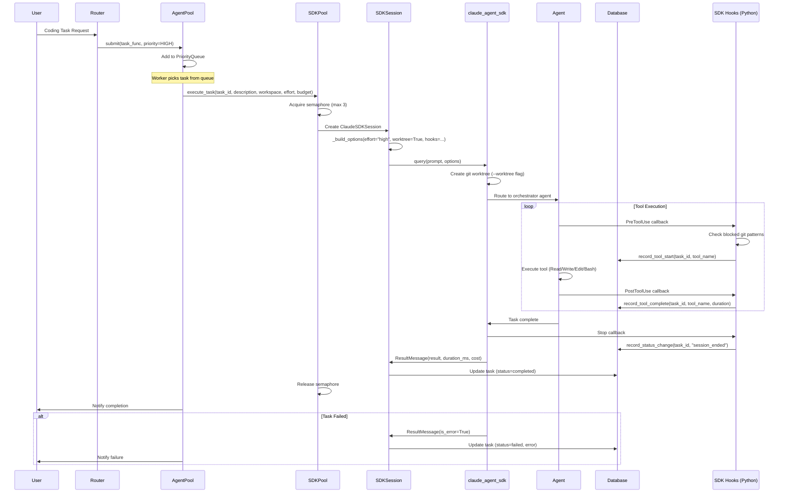
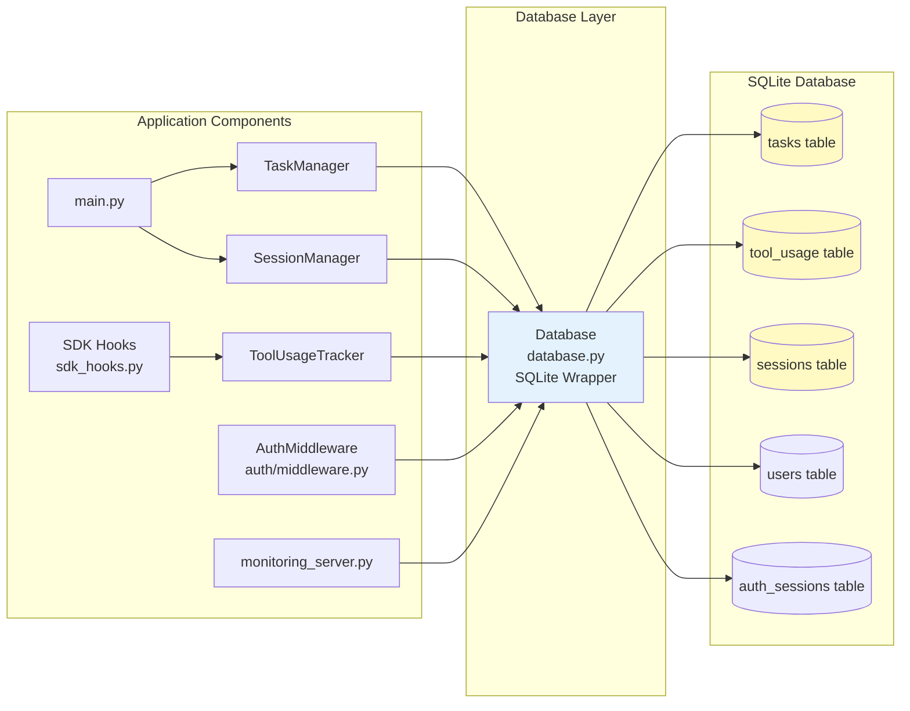
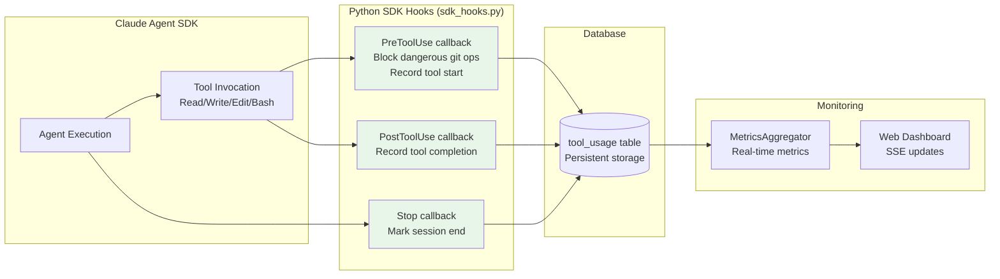

# AMIGA Architecture

> Comprehensive system architecture documentation for AMIGA (Autonomous Modular Interactive Graphical Agent)

**Last Updated**: 2026-03-11
**Version**: 2.0

---

## Table of Contents

1. [Overview](#overview)
2. [System Architecture](#system-architecture)
3. [Message Routing Flow](#message-routing-flow)
4. [Background Task Execution](#background-task-execution)
5. [Database Interactions](#database-interactions)
6. [Hook System Data Flow](#hook-system-data-flow)
7. [Component Reference](#component-reference)
8. [Data Flow Narratives](#data-flow-narratives)

---

## Overview

### Project Purpose

AMIGA (Autonomous Modular Interactive Graphical Agent) is a Telegram bot that provides AI-powered assistance for both conversational Q&A and complex coding tasks. The system intelligently routes work to the appropriate Claude model based on task complexity, optimizing for both cost and capability.

### Design Philosophy

**Right model for the right task**: Fast and cheap (Haiku) for routing, powerful (Sonnet) for implementation, maximum reasoning (Opus) for deep debugging. Each tier has explicit effort and budget caps.

**Key Architectural Decisions**:

1. **Async-First Design**: All I/O operations use asyncio for non-blocking concurrency
2. **Manager Pattern**: Encapsulated resource management (tasks, sessions, agents, worktrees)
3. **SQLite Backend**: Centralized database for tasks, tool usage, user sessions, and auth tokens
4. **SDK Hook Callbacks**: Python SDK hooks (`claude/sdk_hooks.py`) replace shell script hooks for tool observability and git safety enforcement
5. **Priority Queue System**: Background task execution with priority levels (URGENT, HIGH, NORMAL, LOW)
6. **Per-User Isolation**: Independent message queues, sessions, and cost tracking per user
7. **Native SDK Worktrees**: Task isolation via SDK `--worktree` flag; no manual worktree management
8. **Markdown Agent Definitions**: Agents defined in `.claude/agents/*.md` with YAML frontmatter, loaded at runtime by `claude/agent_loader.py`

### Technology Stack

- **Python 3.12+**: Core application language with asyncio
- **Claude Agent SDK (`claude_agent_sdk`)**: Primary integration layer — `query()`, `ClaudeAgentOptions`, hooks, agent definitions
- **Claude API (Haiku)**: Fast Q&A and routing decisions via orchestrator (effort=low, max $0.50)
- **Claude Sonnet**: Implementation tasks (effort=high, max $5.00)
- **Claude Opus**: Deep debugging via ultrathink-debugger (effort=max, max $10.00)
- **python-telegram-bot**: Telegram Bot API integration
- **SQLite**: Persistent storage (tasks, tool usage, sessions, auth tokens)
- **Flask + SSE**: Real-time monitoring dashboard
- **WebSockets (SocketIO)**: Web chat interface
- **Whisper**: Voice message transcription

---

## System Architecture

```mermaid
graph TB
    subgraph "User Interfaces"
        TG[Telegram Bot]
        WEB[Web Chat Dashboard]
        VOICE[Voice Messages]
    end

    subgraph "Entry Points"
        MAIN[main.py<br/>Telegram Handler]
        MON[monitoring_server.py<br/>Web Server + API]
    end

    subgraph "Routing Layer"
        ROUTER[Message Router<br/>Simple/Question/Task Detection]
        CLAUDE_API[claude_api.py<br/>Claude API Integration<br/>Haiku 4.5]
    end

    subgraph "Task Execution Layer"
        POOL[AgentPool<br/>Priority Queue<br/>3 Concurrent Workers]
        SDK_POOL[ClaudeSDKPool<br/>sdk_client.py<br/>Semaphore-based concurrency]
        SDK_SESSION[ClaudeSDKSession<br/>claude_agent_sdk.query()<br/>Effort + Budget Controls]
    end

    subgraph "Agent System"
        ORCH[orchestrator<br/>Task Coordinator<br/>effort=low]
        CODE[code_agent<br/>Backend Implementation<br/>effort=high]
        FRONT[frontend_agent<br/>UI/UX Development]
        RESEARCH[research_agent<br/>Analysis & Research<br/>Opus]
        DEBUG[ultrathink-debugger<br/>Deep Debugging<br/>effort=max]
        QA[Quality Agents<br/>Jenny, Validators, etc.]
    end

    subgraph "Storage Layer"
        DB[(SQLite Database<br/>data/agentlab.db)]
        LOGS[Log Files<br/>logs/]
        SESSION_LOGS[Session Logs<br/>logs/sessions/]
    end

    subgraph "Observability"
        HOOKS[SDK Hooks<br/>sdk_hooks.py<br/>PreToolUse / PostToolUse / Stop]
        METRICS[MetricsAggregator<br/>Real-Time Metrics]
        DASHBOARD[Web Dashboard<br/>SSE Updates]
    end

    TG --> MAIN
    WEB --> MON
    VOICE --> MAIN

    MAIN --> ROUTER
    ROUTER -->|Simple Commands| MAIN
    ROUTER -->|Questions| CLAUDE_API
    ROUTER -->|Coding Tasks| POOL

    CLAUDE_API -->|Background Task| POOL
    CLAUDE_API --> MAIN

    POOL --> SDK_POOL
    SDK_POOL --> SDK_SESSION
    SDK_SESSION --> ORCH
    ORCH --> CODE
    ORCH --> FRONT
    ORCH --> RESEARCH
    ORCH --> DEBUG
    ORCH --> QA

    SDK_SESSION --> HOOKS
    HOOKS --> SESSION_LOGS
    HOOKS --> METRICS
    METRICS --> DASHBOARD

    SDK_POOL --> DB
    POOL --> DB
    MAIN --> DB

    CODE --> DB
    CODE --> LOGS

    MON --> DB
    MON --> METRICS
    MON --> DASHBOARD
```

### Layer Responsibilities

**User Interfaces**: Multiple input channels (Telegram, web chat, voice)

**Entry Points**: Main application entry and web server

**Routing Layer**: Intelligent routing based on query complexity

**Task Execution Layer**: Background task management with priority queuing

**Agent System**: Specialized agents for different task types

**Storage Layer**: Persistent state and logging

**Observability**: Real-time metrics and monitoring

---

## Message Routing Flow

```mermaid
flowchart TD
    START([User Sends Message]) --> CHECK_CMD{Command?}

    CHECK_CMD -->|/start, /help, etc.| DIRECT[Direct Response<br/>No AI Needed]
    CHECK_CMD -->|/status, /usage| QUERY_DB[Query Database<br/>Format Response]
    CHECK_CMD -->|Regular Message| SANITIZE[Sanitize Input<br/>Check Injection]

    SANITIZE --> INJECT{Malicious?}
    INJECT -->|Yes| BLOCK[Block Request<br/>Log Warning]
    INJECT -->|No| CLAUDE_API[Claude API Call<br/>Haiku 4.5]

    CLAUDE_API --> DETECT{Response Type?}

    DETECT -->|Direct Answer| FORMAT[Format Response<br/>Split Chunks 4096 chars]
    DETECT -->|BACKGROUND_TASK| PARSE[Parse Format<br/>task_desc|user_msg]

    PARSE --> VALIDATE{Valid Format?}
    VALIDATE -->|No| ERROR[Error Response<br/>Log Issue]
    VALIDATE -->|Yes| CREATE_TASK[Create Task Record<br/>task_id, status=pending]

    CREATE_TASK --> NOTIFY[Immediate User Notification<br/>"Working on it..."]
    NOTIFY --> QUEUE[Submit to AgentPool<br/>Priority=HIGH]

    QUEUE --> END([Message Processed])
    FORMAT --> END
    QUERY_DB --> END
    DIRECT --> END
    BLOCK --> END
    ERROR --> END

    style CLAUDE_API fill:#e1f5ff
    style CREATE_TASK fill:#fff4e6
    style QUEUE fill:#e8f5e9
```

### Routing Decision Logic

1. **Simple Commands**: Direct response (no AI needed)
   - `/start`, `/help`: Static messages
   - `/clear`: Session management
   - `/restart`: Bot control (owner only)

2. **Query Commands**: Database lookup + formatting
   - `/status`: Session stats, active tasks, costs
   - `/usage`: API usage breakdown
   - `/stopall`: Cancel running tasks

3. **Regular Messages**: Claude API routing
   - Input sanitization (XML escape, injection detection)
   - Claude API call with context (history, tasks, logs)
   - Response parsing for BACKGROUND_TASK format

4. **Background Task Detection**: Format validation
   - Expected format: `BACKGROUND_TASK|task_description|user_message`
   - Strips markdown code blocks
   - Creates task record and queues for execution

---

## Background Task Execution


```mermaid
sequenceDiagram
    participant User
    participant Router
    participant AgentPool
    participant SDKPool
    participant SDKSession
    participant SDK as claude_agent_sdk
    participant Agent
    participant Database
    participant Hooks as SDK Hooks (Python)

    User->>Router: Coding Task Request
    Router->>AgentPool: submit(task_func, priority=HIGH)
    AgentPool->>AgentPool: Add to PriorityQueue

    Note over AgentPool: Worker picks task from queue

    AgentPool->>SDKPool: execute_task(task_id, description, workspace, effort, budget)
    SDKPool->>SDKPool: Acquire semaphore (max 3)
    SDKPool->>SDKSession: Create ClaudeSDKSession

    SDKSession->>SDKSession: _build_options(effort="high", worktree=True, hooks=...)
    SDKSession->>SDK: query(prompt, options)
    SDK->>SDK: Create git worktree (--worktree flag)
    SDK->>Agent: Route to orchestrator agent

    loop Tool Execution
        Agent->>Hooks: PreToolUse callback
        Hooks->>Hooks: Check blocked git patterns
        Hooks->>Database: record_tool_start(task_id, tool_name)
        Agent->>Agent: Execute tool (Read/Write/Edit/Bash)
        Agent->>Hooks: PostToolUse callback
        Hooks->>Database: record_tool_complete(task_id, tool_name, duration)
    end

    Agent->>SDK: Task complete
    SDK->>Hooks: Stop callback
    Hooks->>Database: record_status_change(task_id, "session_ended")
    SDK->>SDKSession: ResultMessage(result, duration_ms, cost)
    SDKSession->>Database: Update task (status=completed)
    SDKPool->>SDKPool: Release semaphore
    AgentPool->>User: Notify completion

    alt Task Failed
        SDK->>SDKSession: ResultMessage(is_error=True)
        SDKSession->>Database: Update task (status=failed, error)
        AgentPool->>User: Notify failure
    end
```

### Task Lifecycle States

1. **pending**: Task created, queued for execution
2. **running**: Active execution in ClaudeSessionPool
3. **completed**: Successful completion with result
4. **failed**: Execution error with error message
5. **stopped**: User-initiated cancellation

### Priority Levels

- **URGENT (0)**: User-facing errors, critical failures
- **HIGH (1)**: User requests, interactive tasks
- **NORMAL (2)**: Background tasks, routine operations (default)
- **LOW (3)**: Maintenance, cleanup, analytics

---

## Database Interactions


```mermaid
graph LR
    subgraph "Application Components"
        MAIN[main.py]
        TASK_MGR[TaskManager]
        SESS_MGR[SessionManager]
        TOOL_TRACK[ToolUsageTracker]
        HOOKS[SDK Hooks<br/>sdk_hooks.py]
        AUTH[AuthMiddleware<br/>auth/middleware.py]
        MON[monitoring_server.py]
    end

    subgraph "Database Layer"
        DB[Database<br/>database.py<br/>SQLite Wrapper]
    end

    subgraph "SQLite Database"
        TASKS_TABLE[(tasks table)]
        TOOL_TABLE[(tool_usage table)]
        SESS_TABLE[(sessions table)]
        USERS_TABLE[(users table)]
        AUTH_TABLE[(auth_sessions table)]
    end

    MAIN --> TASK_MGR
    MAIN --> SESS_MGR

    TASK_MGR --> DB
    SESS_MGR --> DB
    TOOL_TRACK --> DB
    HOOKS --> TOOL_TRACK
    AUTH --> DB
    MON --> DB

    DB --> TASKS_TABLE
    DB --> TOOL_TABLE
    DB --> SESS_TABLE
    DB --> USERS_TABLE
    DB --> AUTH_TABLE

    style DB fill:#e3f2fd
    style TASKS_TABLE fill:#fff9c4
    style TOOL_TABLE fill:#fff9c4
    style SESS_TABLE fill:#fff9c4
```

### Database Schema

**tasks table**:
```sql
CREATE TABLE tasks (
    task_id TEXT PRIMARY KEY,
    user_id INTEGER NOT NULL,
    description TEXT NOT NULL,
    status TEXT NOT NULL,           -- pending/running/completed/failed/stopped
    created_at TEXT NOT NULL,
    updated_at TEXT NOT NULL,
    model TEXT NOT NULL,
    workspace TEXT NOT NULL,
    agent_type TEXT NOT NULL,
    session_uuid TEXT,              -- UUID for logs/sessions/<uuid>/
    result TEXT,
    error TEXT,
    pid INTEGER,
    activity_log TEXT,              -- JSON array
    workflow TEXT,
    context TEXT
);
```

**tool_usage table**:
```sql
CREATE TABLE tool_usage (
    id INTEGER PRIMARY KEY AUTOINCREMENT,
    timestamp TEXT NOT NULL,
    task_id TEXT NOT NULL,
    tool_name TEXT NOT NULL,
    duration_ms REAL,
    success BOOLEAN,
    error TEXT,
    error_category TEXT,
    parameters TEXT,                -- JSON blob
    screenshot_path TEXT,
    input_tokens INTEGER,
    output_tokens INTEGER,
    cache_creation_tokens INTEGER,
    cache_read_tokens INTEGER
);
```

**sessions table**:
```sql
CREATE TABLE sessions (
    user_id INTEGER PRIMARY KEY,
    history TEXT NOT NULL,           -- JSON array
    last_activity TEXT NOT NULL,
    token_count INTEGER DEFAULT 0
);
```

### Manager Pattern

All database access goes through manager classes that encapsulate resource lifecycle:

- **TaskManager**: CRUD operations for tasks, status updates, task lifecycle
- **SessionManager**: Conversation history, token tracking, cleanup
- **ToolUsageTracker**: Tool invocation logging, error categorization
- **WorktreeManager**: Git worktree creation/cleanup for task isolation (deprecated — SDK handles this natively via `--worktree` flag)

Benefits:
- Single responsibility (managers handle their domain)
- Consistent error handling
- Easy to test and mock
- Clear API contracts

---

## Hook System Data Flow


```mermaid
flowchart LR
    subgraph "Claude Agent SDK"
        AGENT[Agent Execution]
        TOOL_CALL[Tool Invocation<br/>Read/Write/Edit/Bash]
    end

    subgraph "Python SDK Hooks (sdk_hooks.py)"
        PRE_HOOK[PreToolUse callback<br/>Block dangerous git ops<br/>Record tool start]
        POST_HOOK[PostToolUse callback<br/>Record tool completion]
        STOP_HOOK[Stop callback<br/>Mark session end]
    end

    subgraph "Database"
        TOOL_DB[(tool_usage table<br/>Persistent storage)]
    end

    subgraph "Monitoring"
        METRICS[MetricsAggregator<br/>Real-time metrics]
        DASHBOARD[Web Dashboard<br/>SSE updates]
    end

    AGENT --> TOOL_CALL
    TOOL_CALL --> PRE_HOOK
    PRE_HOOK --> TOOL_DB

    TOOL_CALL --> POST_HOOK
    POST_HOOK --> TOOL_DB

    AGENT --> STOP_HOOK
    STOP_HOOK --> TOOL_DB

    TOOL_DB --> METRICS
    METRICS --> DASHBOARD

    style PRE_HOOK fill:#e8f5e9
    style POST_HOOK fill:#e8f5e9
    style STOP_HOOK fill:#e8f5e9
```

### Hook System Design

**Module**: `claude/sdk_hooks.py`

**Hook Callbacks** (Python async functions, registered via `HookMatcher`):
1. **PreToolUse** (`create_pre_tool_hook`): Records tool start in `ToolUsageTracker`. For `Bash` tool, checks command against `BLOCKED_GIT_PATTERNS` and returns `decision="block"` if matched.
2. **PostToolUse** (`create_post_tool_hook`): Records tool completion with duration info.
3. **Stop** (`create_stop_hook`): Logs session end via `ToolUsageTracker.record_status_change`.

**Blocked Git Patterns** (enforced in PreToolUse on Bash commands):
- `--no-verify` — pre-commit hooks must not be skipped
- `push --force` / `push -f` — force push is not allowed
- `reset --hard` — hard reset requires confirmation

**Registration**:
```python
from claude.sdk_hooks import build_hooks

hooks = build_hooks(tracker, task_id)
# Returns dict ready for ClaudeAgentOptions(hooks=hooks)
```

**Data Flow**:
1. SDK calls Python hook callbacks in-process (no shell subprocess)
2. `PreToolUse` optionally blocks the tool call before execution
3. `PostToolUse` writes directly to SQLite via `ToolUsageTracker`
4. `MetricsAggregator` reads database for dashboard
5. Dashboard uses SSE to push updates to web UI

**Resilience**:
- Hook callbacks return `SyncHookJSONOutput()` on success or error (never raise)
- `tracker` parameter is optional — hooks are no-ops when `None`
- Database writes are fire-and-forget (logged on failure)

---

## Component Reference

### Claude SDK Modules (`claude/`)

**sdk_client.py** — Primary execution layer
- `ClaudeSDKSession`: Wraps `query()` with effort/budget/worktree/hook wiring. Handles `ResultMessage`, `AssistantMessage`, `SystemMessage`.
- `ClaudeSDKPool`: Semaphore-based pool for up to 3 concurrent `ClaudeSDKSession`s. Replaces `ClaudeSessionPool`.
- `invoke_orchestrator_sdk()`: Lightweight orchestrator invocation (effort=low, model=haiku, max_turns=5).
- Cost constants: `ORCHESTRATOR_EFFORT="low"` ($0.50 cap), `TASK_EFFORT="high"` ($5.00 cap), `DEBUG_EFFORT="max"` ($10.00 cap).

**sdk_hooks.py** — In-process hook callbacks
- `build_hooks(tracker, task_id)`: Returns `dict[str, list[HookMatcher]]` for `ClaudeAgentOptions(hooks=...)`.
- `BLOCKED_GIT_PATTERNS`: Tuple of `(pattern, reason)` pairs checked in Bash PreToolUse.
- `create_pre_tool_hook` / `create_post_tool_hook` / `create_stop_hook`: Individual hook factories.

**agent_loader.py** — Agent definition loader
- `load_project_agents(project_root)`: Discovers `.claude/agents/*.md`, returns `dict[str, AgentDefinition]`.
- `parse_agent_file(file_path)`: Parses single file. Returns `(name, AgentDefinition)` or `None`.
- Frontmatter: regex-based YAML parser (no `pyyaml` dependency). Skips `CHANGELOG.md`.

### Auth Modules (`auth/`)

**middleware.py** — JWT token management
- `AuthMiddleware.generate_tokens()`: Returns `(access_token, refresh_token, session_id)` 3-tuple.
- `verify_access_token()`: Validates JWT and checks session validity in SQLite.
- `refresh_access_token()`: Issues new access token from a valid refresh token.
- `logout_session()`: Invalidates session in database.

**session_manager.py** — Auth session lifecycle
- Stores sessions in SQLite with expiration and inactivity timeout.
- Activity tracking: last-seen timestamp updated on each verified request.
- `AuthSessionManager` initialized from `core.config.DATABASE_PATH_STR`.

### Entry Points

**main.py**
- Telegram bot setup and command handlers
- Message routing (commands vs questions vs tasks)
- User authentication and rate limiting
- Voice message transcription (Whisper)
- Session management and cleanup
- PID file locking (single instance)

**monitoring_server.py**
- Flask web server for dashboard
- SSE (Server-Sent Events) for real-time updates
- WebSocket support for web chat interface
- REST API for metrics and task data
- User authentication: session-backed JWT tokens (access + refresh) via `auth/middleware.py`

### Core Modules

**database.py**
- SQLite wrapper with connection pooling
- Schema versioning and migrations
- Row factory for dict-like access
- WAL mode for concurrent reads
- Foreign key enforcement

**config.py**
- Centralized configuration management
- Environment variable loading
- Path resolution (data, logs, sessions)
- Constants and defaults

### Manager Classes

See `docs/API.md` for detailed API documentation of manager classes:

- **TaskManager**: Task CRUD, status tracking, lifecycle management
- **SessionManager**: Conversation history, token limits, cleanup
- **AgentPool**: Priority queue, worker pool, task submission
- **ClaudeSDKPool** (`claude/sdk_client.py`): Semaphore-based pool for concurrent SDK sessions; replaces `ClaudeSessionPool`
- **ClaudeSDKSession** (`claude/sdk_client.py`): Wraps `claude_agent_sdk.query()` with effort/budget options, worktree flag, and hook wiring
- **MessageQueueManager**: Per-user message serialization
- **WorktreeManager**: Git worktree isolation (deprecated — SDK now handles worktrees natively via `--worktree` flag)
- **GameManager**: Interactive game state management

### Agent System

**Location**: `.claude/agents/`

**Loading**: `claude/agent_loader.py` — `load_project_agents()` globs `*.md` files, parses YAML frontmatter, and returns `dict[str, AgentDefinition]` for passing to `ClaudeAgentOptions(agents=...)`.

**Frontmatter Schema** (required: `name`, `description`; optional: `tools`, `model`):
```yaml
---
name: code_agent
description: Backend Python implementation agent
tools: Read, Edit, Write, Bash, Glob, Grep
model: sonnet
---

[Markdown body becomes the system prompt]
```

**Core Agents**:
- **orchestrator.md**: Task coordinator, delegates to specialized agents (effort=low)
- **code_agent.md**: Backend implementation (Python, effort=high)
- **frontend_agent.md**: UI/UX development (HTML/CSS/JS)
- **research_agent.md**: Analysis, proposals, research (Opus)

**Quality Assurance Agents**:
- **Jenny.md**: Spec verification
- **claude-md-compliance-checker.md**: Project compliance
- **code-quality-pragmatist.md**: Complexity detection
- **karen.md**: Reality checks
- **task-completion-validator.md**: Functional validation
- **ui-comprehensive-tester.md**: UI testing
- **debug-agent.md**: General debugging (Sonnet)
- **ultrathink-debugger.md**: Deep debugging (Opus, effort=max)

**Planning & Git Agents**:
- **task-decomposer.md**: Breaks large tasks into subtasks with effort estimates
- **git-worktree.md**: Git worktree creation and cleanup
- **git-merge.md**: Git merge and conflict resolution

**Autonomous Agents**:
- **self-improvement-agent.md**: Analyzes SQLite error patterns; updates agent prompts and creates fix tasks autonomously

**Agent Configuration**:
- Model selection via `model:` frontmatter field (`sonnet`, `opus`, `haiku`, `inherit`)
- Tool permissions via `tools:` (comma-separated list)
- System prompt is the markdown body after the closing `---`
- Files without valid `name` + `description` frontmatter are skipped with a warning

### Testing Infrastructure

**Location**: `tests/`

**Test Structure**:
- `conftest.py`: pytest fixtures and configuration
- `tests/unit/test_*.py`: Unit tests (57 modules total)
- Coverage reporting via pytest-cov

**Key Test Modules (recent)**:
- `tests/unit/test_sdk_client.py` — `ClaudeSDKSession`, `ClaudeSDKPool`, `invoke_orchestrator_sdk` (43 tests)
- `tests/unit/test_agent_loader.py` — frontmatter parsing, edge cases, model mapping (41 tests)
- `tests/unit/test_sdk_hooks.py` — git safety patterns, hook callbacks, build_hooks (34 tests)

**Running Tests**:
```bash
pytest tests/ -v
pytest tests/ --cov=.
```

**Coverage Targets**:
- Critical paths: 80%+
- Utility functions: 100%
- Handlers: Best effort

---

## Data Flow Narratives

### User Sends Message

**Scenario**: User sends "Fix the login bug" to the Telegram bot

1. **Message Reception** (main.py):
   - Telegram webhook delivers message to bot
   - User authentication check (ALLOWED_USERS)
   - Rate limiting check (30/min, 500/hour per user)
   - Message added to per-user queue (serialization)

2. **Input Sanitization** (claude_api.py):
   - HTML escape XML special characters
   - Remove dangerous patterns (closing tags, injection attempts)
   - Detect prompt injection (instruction override, role manipulation)
   - If malicious, block and log warning

3. **Claude API Routing** (claude_api.py):
   - Build context: conversation history (last 2 messages), active tasks (max 3), recent logs (50 lines)
   - Sanitize all context for XML embedding
   - Call Claude API (Haiku 4.5) with system prompt
   - Parse response for BACKGROUND_TASK format

4. **Background Task Creation** (tasks.py):
   - Response: `BACKGROUND_TASK|Fix login authentication bug|I'll fix the login bug for you.`
   - Parse pipe-delimited format
   - Validate format and content
   - Create task record in database (status=pending)
   - Generate unique task_id and session_uuid

5. **User Notification** (main.py):
   - Send immediate acknowledgment: "I'll fix the login bug for you."
   - User can continue chatting or check `/status`

6. **Task Queueing** (agent_pool.py):
   - Submit task to AgentPool with priority=HIGH
   - Add to PriorityQueue (sorted by priority, then FIFO)
   - Worker picks task when available (max 3 concurrent)

### Background Task Execution

**Scenario**: AgentPool worker processes "Fix login bug" task

1. **Session Acquisition** (`claude/sdk_client.py` — `ClaudeSDKPool`):
   - Semaphore limits concurrency to 3 simultaneous tasks
   - Creates a `ClaudeSDKSession` for this task
   - Records workflow assignment (`orchestrator`) in `ToolUsageTracker`

2. **Options Building** (`ClaudeSDKSession._build_options`):
   - Resolves project root (follows `.git` file pointer for worktrees)
   - Sets `effort="high"` and `max_budget_usd=5.0` for task execution
   - Passes `--worktree` flag → SDK automatically creates and manages an isolated git worktree
   - Wires Python SDK hooks via `build_hooks(tracker, task_id)`
   - Sets `TASK_ID` and `PROJECT_ROOT` in env

3. **SDK Query Execution** (`claude_agent_sdk.query()`):
   - Streams messages: `SystemMessage` (init), `AssistantMessage` (turns), `ResultMessage` (final)
   - Logs tool calls from `AssistantMessage` blocks for progress tracking
   - Cancellable via `asyncio.Event` signal

4. **Agent Orchestration** (orchestrator):
   - Analyze task requirements
   - Delegate to code_agent for implementation
   - May consult research_agent for analysis
   - Coordinate with validators for testing

5. **Tool Execution** (code_agent):
   - Read files: `Read(file_path="auth.py")`
   - Make changes: `Edit(file_path="auth.py", old_string="...", new_string="...")`
   - Run tests: `Bash(command="pytest tests/test_auth.py")`
   - Commit: `Bash(command="git add . && git commit -m '...'")`

6. **Hook Callbacks** (Python SDK hooks — `claude/sdk_hooks.py`):
   - `PreToolUse`: records tool start; blocks dangerous Bash git commands in-process
   - `PostToolUse`: records tool completion with duration to SQLite via `ToolUsageTracker`
   - `Stop`: marks session end in tracker
   - MetricsAggregator reads database for real-time dashboard updates

7. **Task Completion**:
   - `ResultMessage` delivers final result text, duration, cost, turn count
   - Update task record: status=completed, result=summary, session_uuid
   - Semaphore released for next task
   - Notify user via Telegram/web chat

8. **Worktree Management** (handled by SDK natively):
   - SDK creates worktree before execution (`use_worktree=True`)
   - SDK cleans up worktree after completion
   - No manual worktree agent invocation needed

### Tool Usage Tracking

**Scenario**: Agent executes Read tool and encounters error

1. **PreToolUse Hook** (`sdk_hooks.py` — `create_pre_tool_hook`):
   - SDK calls Python callback in-process before tool execution
   - Extract: `tool_name="Read"`, `tool_input={"file_path": "/missing/file.py"}`
   - Call `tracker.record_tool_start(task_id, "Read", params)`
   - For Bash tool: check command against `BLOCKED_GIT_PATTERNS`; block if matched
   - Return `SyncHookJSONOutput()` to allow execution

2. **Tool Execution**:
   - SDK attempts to read file
   - File not found, SDK records error internally

3. **PostToolUse Hook** (`sdk_hooks.py` — `create_post_tool_hook`):
   - SDK calls Python callback in-process after tool execution
   - Call `tracker.record_tool_complete(task_id, "Read", duration_ms=0.0, success=True, params)`
   - Write directly to SQLite `tool_usage` table

4. **Metrics Aggregation**:
   - `MetricsAggregator` reads directly from SQLite (no JSONL log parsing needed)
   - Calculate metrics: total tools, errors, duration, token usage
   - Push to dashboard via SSE

5. **Dashboard Display**:
   - Running tasks table shows active task with live tool count
   - Click task to see detailed tool usage log
   - Error panel shows recent tool failures
   - Tool usage chart updates in real-time

### Session Log Correlation

**Problem**: How to correlate tool usage logs with tasks in the database?

**Solution**: session_uuid as correlation key, supplied by the SDK's `ResultMessage`

1. **Task Creation** (tasks.py):
   - Generate task_id; session_uuid starts as `None`
   - Store in database: `tasks(task_id, session_uuid=None, ...)`

2. **SDK Execution** (sdk_client.py):
   - `query()` streams messages; `SystemMessage(subtype="init")` provides early session ID if needed
   - `ResultMessage.session_id` delivers the final SDK session identifier

3. **Session UUID Update**:
   - On `ResultMessage`, `ClaudeSDKSession._record_completion()` calls `db.update_task(task_id, session_uuid=session_id)`
   - Links SDK session to the task record in SQLite

4. **Log Retrieval**:
   - Query database: `SELECT session_uuid FROM tasks WHERE task_id = 'abc123'`
   - Use session_uuid to correlate with tool_usage records: `SELECT * FROM tool_usage WHERE task_id = 'abc123'`
   - No separate JSONL log files — all data written directly to SQLite by SDK hooks

---

## Additional Resources

- **CLAUDE.md**: Repository conventions and project-specific patterns
- **README.md**: Quick start guide and setup instructions
- **docs/API.md**: Detailed API documentation for manager classes
- **docs/archive/AGENT_ARCHITECTURE.md**: Historical agent system design notes
- **.claude/agents/\*.md**: Individual agent configurations and workflows

---

**Maintained By**: Matias Fuentes
**Project**: AMIGA (Autonomous Modular Interactive Graphical Agent) (AMIGA)
**Repository**: https://github.com/matifuentes/agentlab
